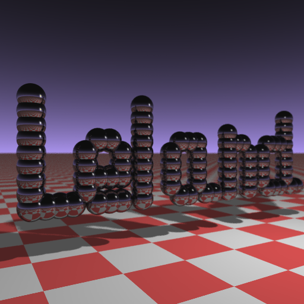

Businesscard Raytracer, now in Rust!
====================================

This is a port of the well known "Bussiness Card Raytracer" from C++ to Rust. It's source and a breakdown of how it works [can be found here.](http://fabiensanglard.net/rayTracing_back_of_business_card/)

## Instructions

Run the following in this directory:

	cargo build --release
	./target/release/raytracer > out.ppm

This will build and run the program, causing it to generate an image at `out.ppm`. To convert this image to `.png`, one can use the `convert` utility. An example of the output image looks like this:

